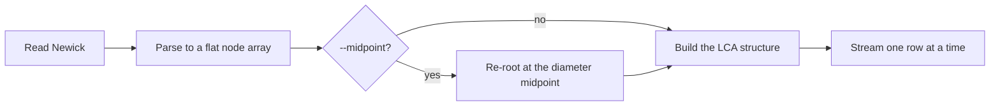

# How it works

A run has five stages. The first four touch the tree once each; the last one
does all the work.

## Parsing

The Newick string is read once to strip whitespace outside quoted labels, then
scanned byte by byte. Every structural character in Newick is ASCII, so a
byte-wise scan is safe on UTF-8 input: no byte of a multi-byte sequence can be
mistaken for a delimiter. Label bytes are collected and decoded as UTF-8 in one
step, which is what keeps accented and CJK tip names intact.

The parser is **iterative**, with an explicit stack of partially built nodes
rather than a recursive descent, so a tree nested hundreds of thousands of
levels deep parses without touching the call stack. The same applies to freeing
the parse tree: the compiler's own drop glue would recurse once per level, so
`RawNode` dismantles its children in a loop instead.

Parsing is strict about structure. Reaching the end of input with parentheses
still open is an error, not an implicit close, and anything after the tree other
than a semicolon and comments is an error too. Both cases used to produce a
matrix rather than a message. See [Input](../guide/input.md#what-is-rejected).

The recursive parse tree is then flattened, again iteratively, into a
`Vec<Node>` where a node is a label, a branch length, a parent index and a list
of child indices. Everything after this point is index arithmetic over flat
arrays.

## Midpoint rooting

Only when `--midpoint` is passed, and only outside `--topology`.

The diameter is found with the standard two-pass sweep: from an arbitrary tip,
walk the tree to the furthest tip `a`; from `a`, walk to the furthest tip `b`.
The second sweep records the path it took, so `a` to `b` can be reconstructed
without a third pass.

distree then walks that path accumulating length until it passes half the
diameter, which locates the edge the midpoint falls on. It inserts a new node
there, splitting the edge into the two pieces either side of the midpoint,
attaches both ends to it, and reverses the parent-child links from the old
parent up to the old root, carrying each branch length down to the node that is
now the child. The result is the same tree hanging from a different point.

The tests check this on 300 generated trees, including polytomies and
zero-length branches, against three properties: every pairwise patristic
distance survives, the result is still a tree with nothing orphaned and no
cycle, and the deepest tip sits exactly half a diameter from the new root.

## The LCA structure

This is where the run buys its speed. Walking the tree for each of `N²` pairs
would cost `O(N² · depth)`. Instead one depth-first pass records, for every node:

- `depth_len`, its summed branch length from the root;
- `depth_top`, its edge count from the root;
- `up[0]`, its parent.

The parent table is then doubled `log₂ M` times, so that `up[k][u]` is the
`2^k`-th ancestor of `u`. Finding the most recent common ancestor of two nodes
becomes: lift the deeper one by the difference in `depth_top`, one power of two
per set bit; then, from the largest jump down to the smallest, move both up
together whenever their ancestors at that level still differ. They meet one step
above where they stop. That is `O(log M)` per query, with no allocation.

The table is stored as one flat `Vec<usize>` with `usize::MAX` standing in for
"no ancestor". An `Option<usize>` would be the obvious type, but it has no spare
niche and so costs 16 bytes per entry instead of 8, across `M log M` entries.

The queries are checked against a brute-force walk from both nodes to the root,
over every pair of nodes in 200 generated trees.

## Computing a cell

With the structure in place, every mode is one MRCA query and three array reads:

| Mode | Cell `(i, j)` |
|:--|:--|
| Patristic | `depth_len[i] + depth_len[j] - 2 · depth_len[m]` |
| Topological | `depth_top[i] + depth_top[j] - 2 · depth_top[m]` |
| Variance-covariance | `depth_len[m]` |

No square root, no allocation, no tree walk. The cost of a cell does not depend
on how far apart the two tips are.

## Streaming the matrix

Tips are collected, checked for duplicates and for characters that would break a
row, and sorted by label. Then, for each row in turn:

1. the row's cells are computed in parallel across the thread pool, into a
   buffer that is reused between rows;
2. the row is written;
3. the next row starts.

At no point does the full matrix exist. Peak memory is the tree plus the LCA
table plus one row, which is why a matrix far larger than RAM can be written to
a file or straight into a pipeline. See
[Performance](performance.md) for the arithmetic.

Rayon splits each row across the available cores, and `-t` caps how many. The
row order and the cell order are fixed regardless of thread count, so two runs
of the same tree produce byte-identical output.

## Why the output is sorted

Tips are ordered by label, not by their position in the tree. That costs one
sort and buys three things: the ordering does not depend on how the Newick was
written, two matrices over the same tips line up cell for cell, and a run is
reproducible without recording anything about the input's layout.

## Next

- [Performance](performance.md), for what all this costs.
- [Distance modes](../guide/distances.md), for what the numbers mean.
